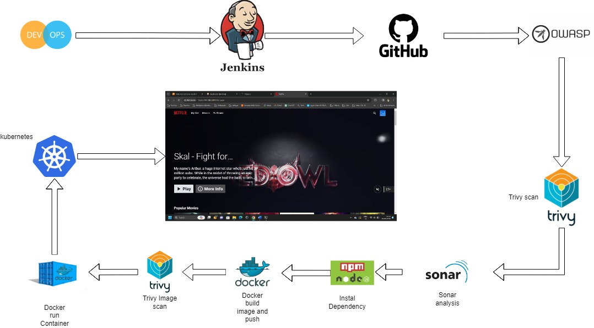

<div align="center">
  <a href="http://netflix-clone-with-tmdb-using-react-mui.vercel.app/">
    
  </a>
  
  <h1 align="center">Getting Started With Netflix Clone</h1>
  <h3 align="center">Our Netflix clone project aims to recreate the immersive experience of the popular streaming platform, allowing users to browse, search, and watch their favorite movies and TV shows. Leveraging the power of modern web technologies, we've developed a comprehensive solution that combines the richness of Netflix's user interface with the flexibility of a customizable streaming service.</h3>
  <p align="center">
    <a href="https://netflix-clone-react-typescript.vercel.app/">View Demo</a>
    ·
    <a href="https://github.com/crazy-man22/netflix-clone-react-typescript/issues">Report Bug</a>
    ·
    <a href="https://github.com/crazy-man22/netflix-clone-react-typescript/issues">Request Feature</a>
  </p>
</div>

<details>
  <summary>Table of Contents</summary>
  <ol>
    <li>
      <a href="#prerequests">Prerequests</a>
    </li>
    <li>
      <a href="#What tools we can use?">What tools we can use?</a>
    </li>
    <li>
      <a href="#Learnings">Learnings</a>
    </li>
    <li>
      <a href="#which-features-this-project-deals-with">Which features this project deals with</a>
    </li>
    <li><a href="#third-party-libraries-used-except-for-react-and-rtk">Third Party libraries used except for React and RTK</a></li>
    <li>
      <a href="#contact">Contact</a>
    </li>
  </ol>
</details>

<br />

<div align="center">
  
  <p align="center">Architectural Diagram</p>
  
  <p align="center">Home Page</p>
  
  <p align="center">Mini Portal</p>
  
  <p align="center">Detail Model</p>
  
  <p align="center">Grid Genre Page</p>
  
  <p align="center">Watch Page with customer contol bar</p>
</div>

## Prerequests
- Create an account if you don't have on [AWS](https://aws.amazon.com/).
- And then follow the [Documentation]((https://docs.aws.amazon.com/SetUp/latest/UserGuide/setup-prereqs-instructions.html)) to create new AWS Account.
- Create an account if you don't have on [TMDB](https://www.themoviedb.org/).
  Because I use its free to utilize the TMDB (The Movie Database) API, our clone fetches movie and TV show data, providing a vast catalog of content for users to explore..
- And then follow the [Documentation](https://developers.themoviedb.org/3/getting-started/introduction).
- Finally, if you use v3 of TMDB API, create a file named `.env`, and copy and paste the content of `.env.example`.
  And then paste the API Key you just created.
- Create an account if you don't have on [DockerHub](https://hub.docker.com/), Because It is Open-Source.
- And then follow the [Documentation]((https://docs.docker.com/docker-id/)) to create a new DockerHub Account.

##What tools we can use?
<div align="center">
  
  <p align="center">Jenkins</p>
Jenkins:
Purpose: 
Jenkins is an open-source automation server that facilitates the continuous integration (CI) and continuous delivery (CD) of software projects.
Features:
Build Automation: 
Jenkins allows developers to automate the building, testing, and deployment of their applications.
Pipeline as Code: 
Jenkins supports defining pipelines as code, enabling teams to define their entire CI/CD process in a human-readable and version-controlled format.
Extensibility: 
Jenkins offers a vast ecosystem of plugins that extend its functionality, enabling integration with various tools and technologies.
Scalability: 
Jenkins can be scaled horizontally to handle large-scale CI/CD workloads.
Usage: 
Developers use Jenkins to automate repetitive tasks in the software development lifecycle, ensuring faster delivery, higher quality, and improved collaboration among team members.

Docker:
Purpose: 
Docker is a platform for developing, shipping, and running applications using containerization technology.
Features:
Containerization: 
Docker containers encapsulate applications and their dependencies, providing consistency and isolation across different environments.
Portability: 
Docker containers can run on any system that supports Docker, enabling developers to build applications once and run them anywhere.
Efficiency: 
Docker's lightweight containers consume fewer resources compared to traditional virtual machines, making them more efficient for resource utilization.
Versioning: 
Docker images can be versioned and stored in registries, allowing for easy sharing and distribution of application components.
Usage: 
Developers use Docker to package their applications and dependencies into containers, streamlining the deployment process and ensuring consistency between development, testing, and production environments.

Integration of Jenkins and Docker:

Containerized Build Environments: 
Jenkins can utilize Docker to dynamically provision build environments for running tests and building artifacts. This ensures that build environments are consistent and isolated from other projects.
Docker Pipeline Steps: 
Jenkins provides built-in pipeline steps for interacting with Docker, allowing developers to build, run, and manage Docker containers directly from their Jenkins pipelines.
Containerized Agents: 
Jenkins agents can be configured as Docker containers, enabling the dynamic provisioning of build agents based on workload demand.
Integration with Docker Registry: 
Jenkins pipelines can push built Docker images to Docker registries, making them available for deployment to production environments.
Environment Consistency: 
By using Docker containers throughout the CI/CD pipeline, developers can ensure that applications are tested and deployed in environments that closely match production, reducing the risk of deployment issues due to environment inconsistencies.

SonarQube:
Purpose: 
SonarQube is a static code analysis tool used to assess and analyze code quality.
Pipeline Role: 
It is typically integrated into a CI/CD pipeline to automatically check code for issues such as bugs, security vulnerabilities, code smells, and maintainability problems.
Usage: 
Developers receive feedback on code quality early in the development process, allowing them to address issues before merging code into the main codebase.

npm (Node Package Manager):
Purpose: 
npm is the default package manager for Node.js. It is used to manage dependencies (libraries and tools) in a Node.js project.
Pipeline Role: 
In a pipeline, npm is often used to install project dependencies, ensuring that the required packages are available before building or running the application.
Usage: 
Developers specify project dependencies in a package.json file, and npm fetches and installs the necessary packages based on this file.

Trivy:
Purpose: 
Trivy is a container image vulnerability scanner. It helps identify security issues in container images.
Pipeline Role: 
Trivy is integrated into CI/CD pipelines to scan container images for known vulnerabilities and security risks before deployment.
Usage: 
By scanning container images, Trivy assists in ensuring that the deployed applications are not running with known vulnerabilities, thus enhancing the overall security posture.

OWASP:
Purpose: 
The OWASP organization provides a set of tools and resources to improve the security of software. In the context of a pipeline, OWASP tools such as OWASP ZAP (Zed Attack Proxy) or OWASP Dependency-Check are commonly used.
Pipeline Role: 
OWASP tools are integrated into CI/CD pipelines to perform security testing, including dynamic application security testing (DAST) and dependency scanning.
Usage: 
OWASP tools help identify and address security vulnerabilities and issues in web applications and their dependencies. By integrating these tools into the pipeline, security checks become an automated part of the development process.

##Learnings

Deploying a Netflix clone to Kubernetes (K8s) using Jenkins and Docker would provide several valuable learnings, both in terms of technical skills and operational insights. Here are some of the key learnings you might gain from such an experience:

Understanding of Microservices Architecture: 
Netflix operates on a microservices architecture, where different components of the application are decoupled and independently deployable. By deploying a Netflix clone to Kubernetes, you would gain insights into architecting and managing microservices-based applications, including service discovery, load balancing, and fault tolerance.

Containerization Concepts: 
Docker enables you to containerize different parts of your application, such as the frontend, backend services, databases, etc. Through this deployment, you would learn how to package applications and their dependencies into Docker containers, ensuring consistency and portability across different environments.

Kubernetes Orchestration: 
Deploying your Netflix clone to Kubernetes introduces you to container orchestration concepts such as pods, deployments, services, and ingresses. You would learn how to leverage Kubernetes to manage and scale your application containers efficiently, as well as handle rolling updates and zero-downtime deployments.

CI/CD Pipelines with Jenkins: 
Implementing CI/CD pipelines with Jenkins allows you to automate the building, testing, and deployment of your application. You would learn how to define pipeline stages for building Docker images, running tests, and deploying to Kubernetes clusters. Additionally, you'd gain experience in integrating Jenkins with source control repositories (e.g., GitHub) and artifact repositories (e.g., Docker Hub).

Infrastructure as Code (IaC): 
Infrastructure as Code principles can be applied to provision and manage Kubernetes clusters using tools like Terraform or Kubernetes manifests. You would learn how to define infrastructure configurations as code, enabling repeatable and consistent deployment of Kubernetes resources.

Observability and Monitoring: 
Operating a Netflix clone on Kubernetes requires robust observability and monitoring solutions to track application performance, detect anomalies, and troubleshoot issues. You would gain insights into setting up monitoring tools like Prometheus and Grafana, as well as logging solutions like Elasticsearch, Fluentd, and Kibana (EFK stack).

Security Best Practices: 
Securing your Netflix clone deployment involves implementing security best practices at various layers, including container security, network security, and access control. You would learn about securing Docker containers, configuring network policies in Kubernetes, and managing authentication and authorization using tools like Kubernetes RBAC (Role-Based Access Control).

Scalability and High Availability: 
Netflix handles a massive volume of traffic and requires scalable and highly available infrastructure. By deploying to Kubernetes, you would learn how to scale your application dynamically based on demand, as well as implement strategies for ensuring high availability and fault tolerance, such as pod autoscaling and multi-zone deployments.

## Which features this project deal with

- How to create and use [Custom Hooks](https://reactjs.org/docs/hooks-custom.html)
- How to use [Context](https://reactjs.org/docs/context.html) and its provider
- How to use lazy and Suspense for [Code-Splitting](https://reactjs.org/docs/code-splitting.html)
- How to use a new [lazy](https://reactrouter.com/en/main/route/lazy) feature of react-router to reduce bundle size.
- How to use data [loader](https://reactrouter.com/en/main/route/loader) of react-router, and how to use redux dispatch in the loader to fetch data before rendering component.
- How to use [Portal](https://reactjs.org/docs/portals.html)
- How to use [Fowarding Refs](https://reactjs.org/docs/forwarding-refs.html) to make components reusuable
- How to create and use [HOC](https://reactjs.org/docs/higher-order-components.html)
- How to customize default theme of [MUI](https://mui.com/)
- How to use [RTK](https://redux-toolkit.js.org/introduction/getting-started)
- How to use [RTK Query](https://redux-toolkit.js.org/rtk-query/overview)
- How to customize default classname of [MUI](https://mui.com/material-ui/experimental-api/classname-generator)
- Infinite Scrolling(using [Intersection Observer API](https://developer.mozilla.org/en-US/docs/Web/API/Intersection_Observer_API))
- How to make awesome carousel using [slick-carousel](https://react-slick.neostack.com)

## Third Party libraries used except for React and RTK

- [react-router-dom@v6.9](https://reactrouter.com/en/main)
- [MUI(Material UI)](https://mui.com/)
- [framer-motion](https://www.framer.com/docs/)
- [video.js](https://videojs.com)
- [react-slick](https://react-slick.neostack.com/)

## Install with Docker

```sh
docker build --build-arg TMDB_V3_API_KEY=your_api_key_here -t netflix-clone .

docker run --name netflix-clone-website --rm -d -p 80:80 netflix-clone
```

## Todo

- Make the animation of video card portal more similar to Netflix.
- Improve performance. I am using `context` and `provider` but all components subscribed to the context's value are re-rendered. These re-renders happen even if the part of the value is not used in render of the component. there are [several ways](https://blog.axlight.com/posts/4-options-to-prevent-extra-rerenders-with-react-context/) to prevent the re-renders from these behaviours. In addition to them, there may be several performance issues.
- Replace bundler([Vite](https://vitejs.dev/guide)) with [Turbopack](https://turbo.build/pack/docs/why-turbopack). Turbopack is introduced in Next.js conf recently. It's very fast but it's nor ready to use right now. it just support Next.js, and they plan to support all others as soon as possible. so if it's ready to use, replace [Vite](https://vitejs.dev/guide) with [Turbopack](https://turbo.build/pack/docs/why-turbopack).
- Add accessibilities for better UX.
- Add Tests.
